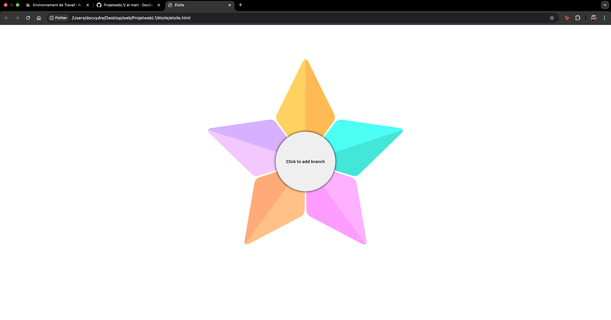
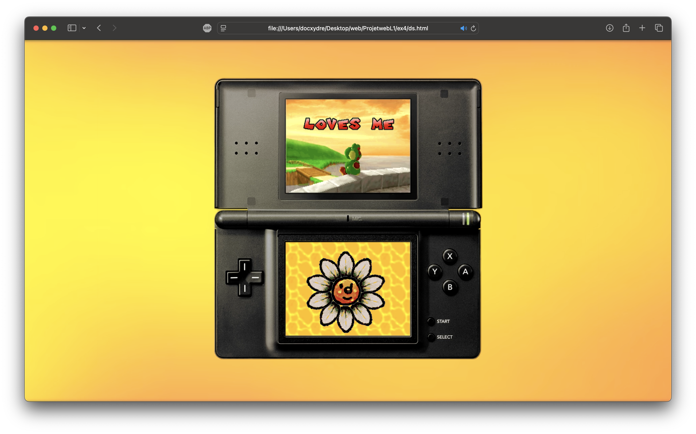

# Projet Étoile Interactif et Mini Jeu

Ce projet comporte deux parties principales :

## Partie 1 : Étoile avec Branches Interactives
- Une étoile est placée au centre de la fenêtre du navigateur.
- En cliquant sur un bouton au centre, des branches apparaissent de manière aléatoire autour de l'étoile.
- Chaque branche peut être supprimée en cliquant dessus.

## Partie 2 : Mini Jeu Inspiré du Jeu DS
- Cette partie reprend la logique de la première, mais transforme le bouton en fleur avec des pétales.
- Chaque pétale supprime un texte et le bouton change d'apparence à chaque interaction.
- Le bouton agit comme un mini-jeu interactif.

### Problème avec la Vidéo de Fond
Le projet utilise une vidéo en arrière-plan qui s'adapte à la taille de l'écran. Cependant, elle peut ne pas être parfaitement ajustée sur tous les navigateurs.

## Installation
Clonez le repository et ouvrez le fichier `etoile.html` pour tester la partie 1 et ouvrez le fichier `ds.html` pour tester la partie 2.

## Technologies utilisées
- HTML
- CSS
- JavaScript
